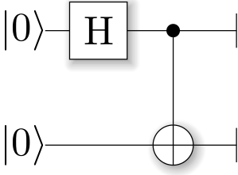
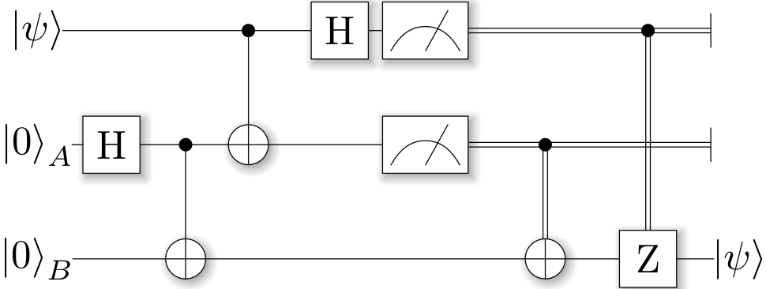

.. _examples:

Examples
========

All of these example codes **and more** can be found on `GitHub <https://github.com/ProjectQ-Framework/ProjectQ/tree/master/examples/>`_.

.. toctree::
   :maxdepth: 2	

Quantum Random Numbers
----------------------

The most basic example is a quantum random number generator (QRNG). It can be found in the examples-folder of ProjectQ. The code looks as follows

.. literalinclude:: ../examples/quantum_random_numbers.py
	:tab-width: 2

Running this code three times may yield, e.g.,

.. code-block:: bash

	$ python examples/quantum_random_numbers.py
	Measured: 0
	$ python examples/quantum_random_numbers.py
	Measured: 0
	$ python examples/quantum_random_numbers.py
	Measured: 1

These values are obtained by simulating this quantum algorithm classically. By changing three lines of code, we can run an actual quantum random number generator using the IBM Quantum Experience back-end:

.. code-block:: bash

	$ python examples/quantum_random_numbers_ibm.py
	Measured: 1
	$ python examples/quantum_random_numbers_ibm.py
	Measured: 0

All you need to do is:

	* Create an account for `IBM's Quantum Experience <https://quantumexperience.ng.bluemix.net/>`_
	* And perform these minor changes:

	.. literalinclude:: ../examples/quantum_random_numbers_ibm.py
		:diff: ../examples/quantum_random_numbers.py
		:tab-width: 2

Quantum Teleportation
---------------------

Alice has a qubit in some interesting state :math:`|\psi\rangle`, which she would like to show to Bob. This does not really make sense, since Bob would not be able to look at the qubit without collapsing the superposition; but let's just assume Alice wants to send her state to Bob for some reason.
What she can do is use quantum teleportation to achieve this task. Yet, this only works if Alice and Bob share a Bell-pair (which luckily happens to be the case). A Bell-pair is a pair of qubits in the state

.. math::

	|A\rangle \otimes |B\rangle = \frac 1{\sqrt 2} \left( |0\rangle\otimes|0\rangle + |1\rangle\otimes|1\rangle \right)

They can create a Bell-pair using a very simple circuit which first applies a Hadamard gate to the first qubit, and then flips the second qubit conditional on the first qubit being in :math:`|1\rangle`. The circuit diagram can be generated by calling the function

.. literalinclude:: ../examples/teleport.py
	:lines: 7,19-25
	:tab-width: 2

with a main compiler engine which has a CircuitDrawer back-end, i.e.,

.. literalinclude:: ../examples/bellpair_circuit.py
	:tab-width: 2

The resulting LaTeX code can be compiled to produce the circuit diagram:

.. code-block:: bash

	$ python examples/bellpair_circuit.py > bellpair_circuit.tex
	$ pdflatex bellpair_circuit.tex
	
The output looks as follows:

Now, this Bell-pair can be used to achieve the quantum teleportation: Alice entangles her qubit with her share of the Bell-pair. Then, she measures both qubits; one in the Z-basis (Measure) and one in the Hadamard basis (Hadamard, then Measure). She then sends her measurement results to Bob who, depending on these outcomes, applies a Pauli-X or -Z gate.

The complete example looks as follows:

.. literalinclude:: ../examples/teleport.py
	:linenos:
	:lines: 1-7,19-28,45-100
	:tab-width: 2

and the corresponding circuit can be generated using

.. code-block:: bash

	$ python examples/teleport_circuit.py > teleport_circuit.tex
	$ pdflatex teleport_circuit.tex

which produces (after renaming of the qubits inside the tex-file):

Shor's algorithm for factoring
------------------------------

As a third example, consider Shor's algorithm for factoring, which for a given (large) number :math:`N` determines the two prime factor :math:`p_1` and :math:`p_2` such that
:math:`p_1\cdot p_2 = N` in polynomial time! This is a superpolynomial speed-up over the best known classical algorithm (which is the number field sieve) and enables the breaking of modern encryption schemes such as RSA on a future quantum computer.

**A tiny bit of number theory**
	There is a small amount of number theory involved, which reduces the problem of factoring to period-finding of the function

	.. math::
		f(x) = a^x\operatorname{mod} N

	for some `a` (relative prime to N, otherwise we get a factor right away anyway by calling `gcd(a,N)`). The period `r` for a function `f(x)` is the number for which :math:`f(x) = f(x+r)\forall x` holds. In this case, this means that :math:`a^x = a^{x+r}\;\; (\operatorname{mod} N)\;\forall x`. Therefore, :math:`a^r = 1 + qN` for some integer q and hence, :math:`a^r - 1 = (a^{r/2} - 1)(a^{r/2}+1) = qN`. This suggests that using the gcd on `N` and :math:`a^{r/2} \pm 1` we may find a factor of `N`!

**Factoring on a quantum computer: An example**
	At the heart of Shor's algorithm lies modular exponentiation of a classically known constant (denoted by `a` in the code) by a quantum superposition of numbers :math:`x`, i.e.,

	.. math::

		|x\rangle|0\rangle \mapsto |x\rangle|a^x\operatorname{mod} N\rangle

	Using :math:`N=15` and :math:`a=2`, and applying this operation to the uniform superposition over all :math:`x` leads to the superposition (modulo renormalization)

	.. math::

		|0\rangle|1\rangle + |1\rangle|2\rangle + |2\rangle|4\rangle + |3\rangle|8\rangle + |4\rangle|1\rangle + |5\rangle|2\rangle + |6\rangle|4\rangle + \cdots

	In Shor's algorithm, the second register will not be touched again before the end of the quantum program, which means it might as well be measured now. Let's assume we measure 2; this collapses the state above to

	.. math::

		|1\rangle|2\rangle + |5\rangle|2\rangle + |9\rangle|2\rangle + \cdots

	The period of `a` modulo `N` can now be read off. On a quantum computer, this information can be accessed by applying an inverse quantum Fourier transform to the x-register, followed by a measurement of x.

**Implementation**
	There is an implementation of Shor's algorithm in the examples folder. It uses the implementation by Beauregard, `arxiv:0205095 <https://arxiv.org/abs/quant-ph/0205095>`_ to factor an n-bit number using 2n+3 qubits. In this implementation, the modular exponentiation is carried out using modular multiplication and shift. Furthermore it uses the semi-classical quantum Fourier transform [see `arxiv:9511007 <https://arxiv.org/abs/quant-ph/9511007>`_]: Pulling the final measurement of the `x`-register through the final inverse quantum Fourier transform allows to run the 2n modular multiplications serially, which keeps one from having to store the 2n qubits of x.
	
	Let's run it using the ProjectQ simulator:
	
	.. code-block:: text
	
		$ python3 examples/shor.py 
		
		projectq
		--------
		Implementation of Shor's algorithm.
		Number to factor: 15

		Factoring N = 15: 00000001

		Factors found :-) : 3 * 5 = 15
	
	Simulating Shor's algorithm at the level of single-qubit gates and CNOTs already takes quite a bit of time for larger numbers than 15. To turn on our **emulation feature**, which does not decompose the modular arithmetic to low-level gates, but carries it out directly instead, we can change the line
	
	.. literalinclude:: ../examples/shor.py
		:lineno-start: 91
		:lines: 91-102
		:emphasize-lines: 9
		:linenos:
		:tab-width: 2
	
	in examples/shor.py to `return True`. This allows to factor, e.g. :math:`N=4,028,033` in under 3 minutes on a regular laptop!
	
	The most important part of the code is
	
	.. literalinclude:: ../examples/shor.py
		:lines: 56-74
		:lineno-start: 56
		:linenos:
		:dedent: 1
		:tab-width: 2
	
	which executes the 2n modular multiplications conditioned on a control qubit `ctrl_qubit` in a uniform superposition of 0 and 1. The control qubit is then measured after performing the semi-classical inverse quantum Fourier transform and the measurement outcome is saved in the list `measurements`, followed by a reset of the control qubit to state 0.
